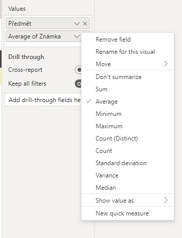

## Vizualizace v Pythonu

S pomocí Pythonu můžeme přidat i vizualizace, které budou interaktivně využívat data z dotazů. Pro vytvoření vizualizace klikneme v nabídce vizualizací na možnost `Python visual`. Následně v menu vpravo vybereme sloupce, se kterými chceme pracovat. Pro vybrané sloupce je vhodné nastavit agregaci jako průměr, abychom nemuseli agregaci řešit v kódu.

{.fig}

Následně se nám zpřístupní editor kódu.

### Použití modulu matplotlib

Pro vytvoření obrázku a souřadnicových os použijeme funkci `subplots()`. Pokud nezadáme žádné parametry, `matplotlib` vytvoří jednu souřadnicovou osu, tj. počítá pouze s jedním grafem na obrázek.

```py
import matplotlib.pyplot as plt
fig, ax = plt.subplots()
```

Pro data o registracích uživatelů provedeme porovnání, jaké marketingové kanály jsou nejdůležitější pro různé skupiny uživatelů. K tomu nejprve potřebujeme provést nový typ agregace, tzv. pivot (nebo také kontingenční) tabulku. Tu vytvoříme pomocí funkce `pivot_table()`. Funkci musíme říct, který sloupec bude použitý jako popisek řádku (parametr `index`), popisek sloupců (parametr `columns`), který sloupec má být použitý pro hodnoty (můžeme zvolit třeba `ip_address`) a funkci pro agregaci (využijeme funkci `len`, což je obecná funkce pro výpočet délky řetězce nebo seznamu).

```py
import pandas
dataset = pandas.read_json("https://raw.githubusercontent.com/pesikj/progr2-python/master/python-pro-data-1/power-bi/assets/user_registration.json")
df_actual_pivot = pandas.pivot_table(dataset, values="age_group", index="marketing_channel", columns="ip_address", aggfunc=len)
print(df_actual_pivot)
```

Vytvořená tabulka je připravená pro grafické zobrazení.

```
age_group                18-29  30-44  45-60   60+
marketing_channel
Friend's recommendation   1795   2268   1423   822
Newspapers or magazine    1052   1397    887  3325
Outdoor                   1097   1401   3318   484
Social network            6738   7186   1433   824
Television                1407   1809   1111   691
```

Využijeme vizualizaci pomocí teplotní mapy, což je zobrazení blízké pivot tabulce, jednotlivé hodnoty jsou ale graficky podbarveny.

Celý kód pro tvorbu vizualizace tedy je:

```py
import matplotlib.pyplot as plt

df_actual_pivot = pandas.pivot_table(dataset, values="ip_address", index="marketing_channel", columns="age_group", aggfunc=len)
fig, ax = plt.subplots()

plt.xticks(range(df_actual_pivot.shape[1]), df_actual_pivot.columns)
plt.yticks(range(df_actual_pivot.shape[0]), df_actual_pivot.index)

plt.imshow(df_actual_pivot, cmap ="viridis")
for i in range(df_actual_pivot.shape[0]):
    for j in range(df_actual_pivot.shape[1]):
        text = ax.text(j, i, df_actual_pivot.iloc[i, j],
                       ha="center", va="center", color="w")
plt.show()
```

### Použití modulu seaborn

Modul `seaborn` je nadstavbou modulu `matplotlib`, který umožňuje vytvořit některé typy vizualizací jednodušeji. Příkladem může být právě teplotní mapa s popisky, jejíž vytváření v `matplotlib` je poněkud pracné. Galerie typů vizualizací, které jsou v modulu `seaborn` k dispozici, je na [oficiálním webu](https://seaborn.pydata.org/examples/index.html).

Modul `seaborn` musíme nejprve importovat. Stejným způsobem jako výše, tj. s využitím funkce `pivot_table()`, vytvoříme kontingenční tabulku. Dále pak použijeme funkci `heatmap` pro vytvoření teplotní mapy. Pomocí parametru `annot` nastavíme, zda chceme zobrazit jednotlivé hodnoty. Pomoc parametru `fmt` pak lze nastavit formátování čísla. Např. `fmt=".0f"` zobrazí řetězec bez desetinných čísel.

```py
import matplotlib.pyplot as plt
import seaborn

df_actual_pivot = pandas.pivot_table(dataset, values="ip_address", index="marketing_channel", columns="age_group", aggfunc=len)
seaborn.heatmap(df_actual_pivot, annot=True, fmt=".0f")
plt.show()
```
