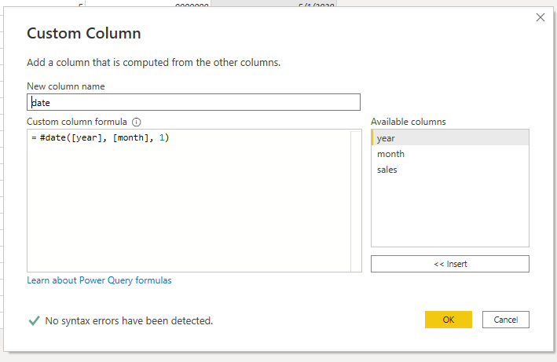
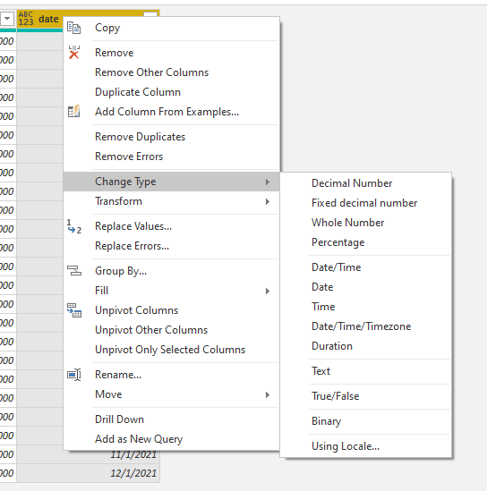
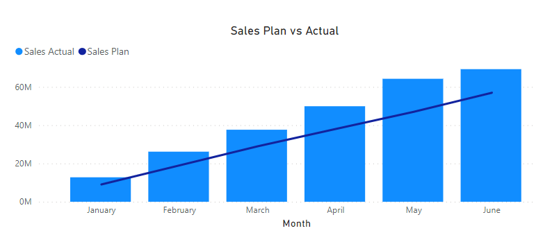
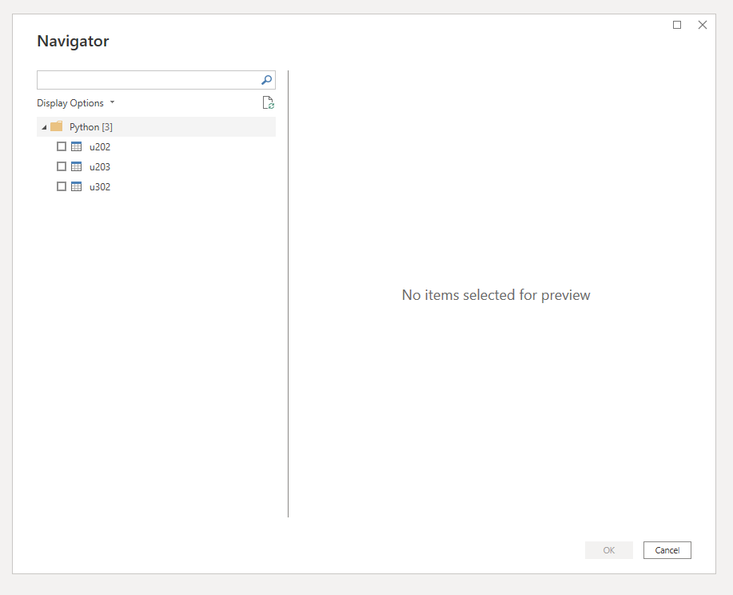
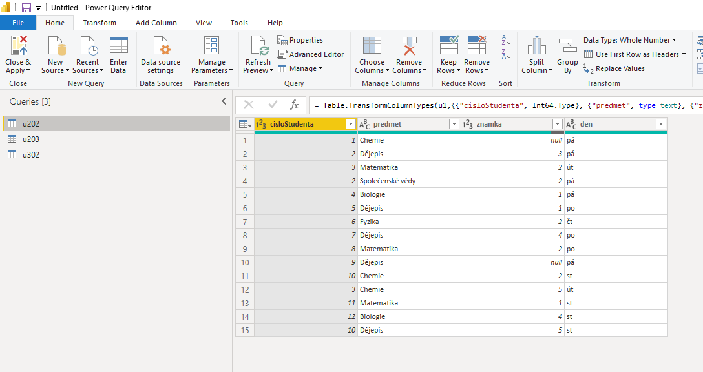
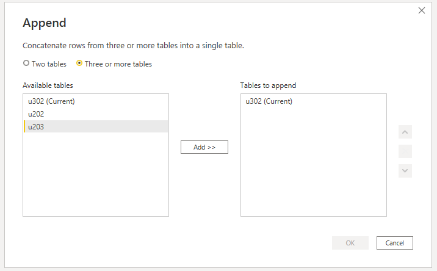
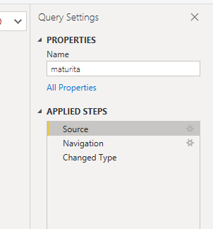

Uzavřené smlouvy jsou často porovnávány s plánem, aby bylo jasné, zda hodnoty uzavřených kontraktů dosahují požadové úrovně. Tabulka s plánem tržeb je ke stažení [zde](https://raw.githubusercontent.com/pesikj/progr2-python/master/python-pro-data-1/power-bi/assets/sales_plan.csv). Tabulku importujeme do Power BI jako nový zdroj.

Tabulka má data zadaná jako čísla - číslo roku a číslo měsíce. Abychom mohli zobrazit obě hodnoty v jednom grafu, potřebujeme k tabulce s plánem přidat datum. Kliknutím na tlačítko `Transform data` otevřeme nástroj Power Query, kde můžeme provádět různé transformace dat.

Nejprve přidáme sloupec s datem. Klikneme na tlačítko `Custom column`, které nám umožní přidat sloupec s hodnotou spočítanou na základě ostatních funkcí. V počítaných sloupcích můžeme využít balík více než 700 funkcí, které jsou popsány [v dokumentaci](https://docs.microsoft.com/en-us/powerquery-m/power-query-m-function-reference). V našem případě využijeme funkci [#datetime](https://docs.microsoft.com/en-us/powerquery-m/sharpdatetime).

{.fig}

Po zavolání funkce bychom měli zkontrolovat typ hodnoty ve sloupci. Pokud není nastaven jako `Date`, provedeme převod pomocí menu `Change Type`.

{.fig}

Jako poslední krok spojíme obě tabulky dohromady. Nejjednodušší je použití tlačítka `Append Queries`, což je obdoba operace UNION v jazyce SQL nebo funkce `concat()` v modulu `pandas`. 

Nyní můžeme přidat vizualizaci `Lined and Stacked column chart` a porovnat, nakolik se obchodníkům daří plnit obchodní plán.

{.fig}

### Využití Pythonu jako zdroje

Python můžeme využít jako zdroj dat a do Power BI můžeme například přenést již hotové skripty. Zkusme tedy nejprve přenést do Power BI výsledky maturity, se kterými jsme již pracovali. 

Ve skupině `Other` vybereme jako zdroj `Python script`. Budeme opět využívat modul `pandas`. Data načteme pomocí metody `read_csv`, do které vložíme URL jednotlivých datových souborů.

Po stisknutí tlačítka OK se zobrazí dialogové okno, ve kterém vybereme, které datové zdroje chceme využít. Jednotlivé "zdroje" se v terminologii Power BI označují jako `query` (dotazy).

{.fig}

Pokud vybereme všechny, uvidíme v levé části okna každý ze zdrojů jako samostatnou položku v menu, kterou si můžeme zobrazit.

{.fig}

Nyní bychom mohli pomocí nástrojů Power Query mohli provést stejné transformace (propojení zdrojů, filtrování, případně agregace), abychom se dostali k obdobným výsledkům jako v předchozí části. Níže je například vidět dialog na pro spojení jednotlivých datových souborů.

{.fig}

Efektivnější ale bude využít již připravený kód v jazyce Python a v Power BI pracovat až s připravenými výsledky. Smažme tedy všechny vytvořené dotazy a přidejme nový skript, ze kterého vybereme pouze dotaz `maturita`.

```
import pandas as pd

u202 = pd.read_csv("https://kodim.cz/czechitas/progr2-python/python-pro-data-1/agregace-a-spojovani/assets/u202.csv")
u203 = pd.read_csv("https://kodim.cz/czechitas/progr2-python/python-pro-data-1/agregace-a-spojovani/assets/u203.csv")
u302 = pd.read_csv("https://kodim.cz/czechitas/progr2-python/python-pro-data-1/agregace-a-spojovani/assets/u302.csv")
u202['mistnost'] = 'u202'
u203['mistnost'] = 'u203'
u302['mistnost'] = 'u302'
maturita = pandas.concat([u202, u203, u302], ignore_index=True)
```

Po vyhodnocení výsledků maturity stačí, abychom tabulky propojili dohromady, 
agregace budou vypočteny automaticky při tvorbě vizualizací. Proto klikneme na tlačítko `Close & Apply`.

*Poznámka:* Pokud bychom se k editaci skriptu chtěli vrátit, klikneme na ikonku ozubeného kola v řádku `Source` v panelu napravo.

{.fig}

## Cvičení
::exc[excs>registrace]
::exc[excs>registrace-2]

## Bonusová cvičení
::exc[excs>registrace-3]
