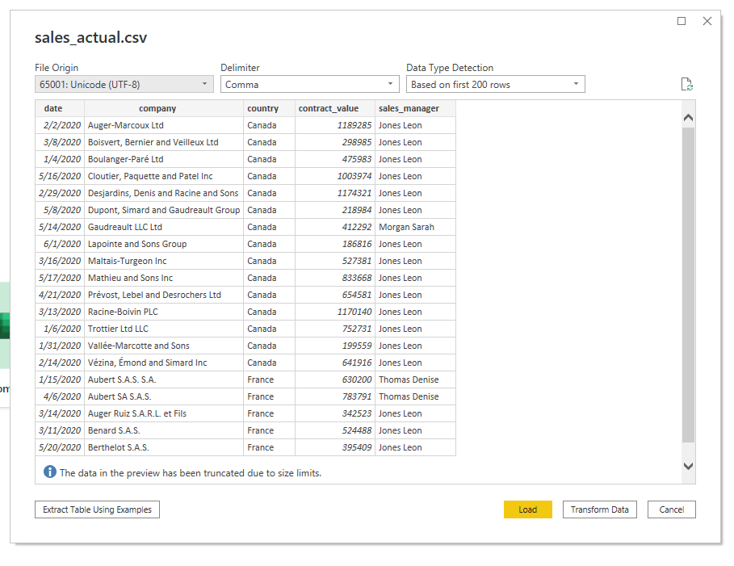
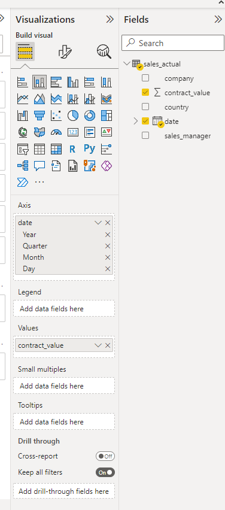
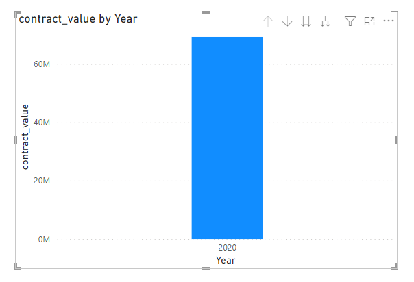
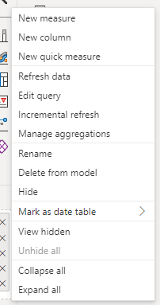

## Zdroje

Power BI obsahuje samostatnou komponentu Power Query, která slouží pro zpracování dat. Prvním krokem je jejich načtení a získání. Power BI podporuje řadu různých zdrojů:

- soubory (např. ve formátu CSV, XML nebo JSON),
- databáze,
- služby Power Platform a cloudové služby Azure,
- on-line služby (např. Sharepoint, Dynamics 365, Google Analytics, GitHub, Twilio a řada dalších),
- ostatní (např. webové stránky či skripty v jazycích Python a R).

### Nahrání dat z CSV souboru

Začněme tím, že si zkusíme do Power BI nahrát soubor [sales_actual.csv](https://raw.githubusercontent.com/pesikj/progr2-python/master/python-pro-data-1/power-bi/assets/sales_actual.csv), který zobrazuje data o uzavřených kontraktech fiktivní firmy. U každého kontraktu vidíme datum uzavření, název zákazníka, stát, ve kterém sídlí, hodnotu kontraktu a odpovědného obchodníka.

Soubor nejprve uložíme na disk, poté v menu Get Data vybereme Text/CSV a najdeme soubor `sales_actual.csv`. Následně klikneme na tlačítko `Load`.

{.fig}

Zkusme si hned vytvořit vizualizaci, aniž bychom data nějak upravovali. Můžeme například vytvořit graf hodnoty uzavřených kontraktů po jednotlivých měsících. K zobrazení dat stačí přetáhnout soupec `contract_value` do sloupce `Values` a sloupec `Date` do pole `Axis`.

Všimněte si dvou ikonek:
- Ikonka sumy u sloupce `contract_value` značí, že sloupec je číselná hodnota a přetáhneme-li ho do pole `Values`, automaticky dojde k součtu hodnot.
- Ikonka kalendáře u sloupce `Date` znamená, že byl sloupec identifikován jako sloupec obsahující datum. Automaticky je u něj vytvořena hierarchie s úrovněmi Rok -> Čtvrtletí -> Měsíc -> Den.

{.fig}

Jedním ze základních úkonů v Business Intelligence a v datové analýze obecně je přesun mezi úrovněmi detailu. Začneme tedy na nejvyšší úrovni a postupně se přesunujeme na vyšší úroveň detailu. Můžeme si vybrat přesun na vyšší detail pro jeden prvek (např. pro jedno čtvrtletí) nebo pro všechny. K tomu slouží ikony jedné a dvou šipek vpravo nahoře u grafu.

{.fig}

U tržeb často sledujeme kumulativní součet, který sleduje nárůst tržeb firmy v průběhu jednoho roku. K tomu můžeme využít tzv. `Quick Measure`, které umožňují přidat nové sloupce s výpočty. Můžeme přidat výpočet typu `Running Total`, což je anglický ekvivalent pro kumulativní součet. Pro vytvoření klikneme na ikonu tří teček u názvu tabulky a vybereme `New Quick Measure`.

{.fig}

Kumulativní součty musíme vytvářet pro konkrétní prvky hiearchie. Nejčastěji sledujeme tržby po měsících, vybereme tedy pole `date - Month`.

{.fig}

Tím získáme graf kumulativního součtu tržeb za jednotlivé dny.

Graf je dále vhodné vylepšit přidáním popisků os a titulku. Obojí lze provést v menu `Format visual`.

{.fig}

